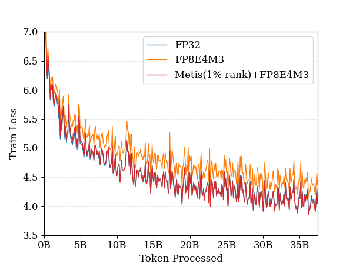
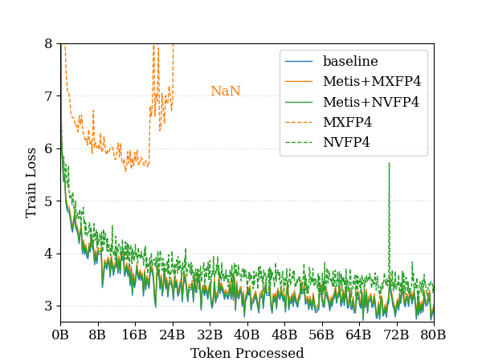
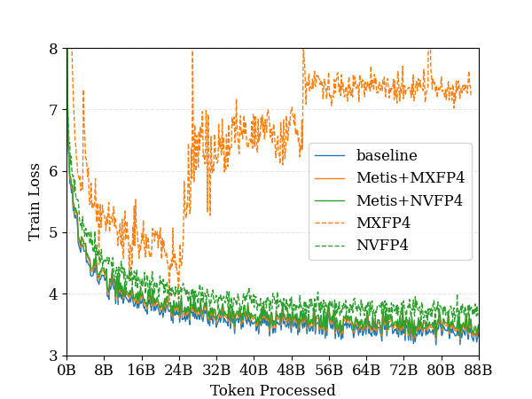
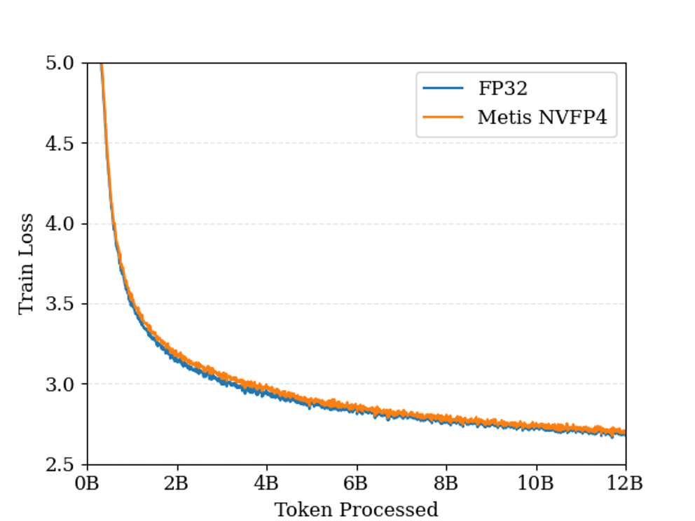

# <center> Metis: Training Large Language Models with Advanced Low-Bit Quantization </center>

This repository provides the official implementation of **Metis**, a framework for stable and efficient training of large language models (LLMs) under **FP8** and **FP4** quantization.

📄 Paper: [Metis: Training Large Language Models with Advanced Low-Bit Quantization](https://arxiv.org/abs/2509.00404)

## 🔑 Highlights

* **Fundamental Insight**: Identifies **anisotropy in parameter distributions** as the root cause of instability in low-bit training.
* **Metis Framework**:

  * **Spectral Decomposition with Random Embedding**: disentangles dominant and long-tail singular components, transforming wide distributions into quantization-friendly forms.
  * **Adaptive Spectral Learning Rate**: balances updates across spectral modes to capture diverse features.
  
* **Efficiency**: The randomized SVD approximation introduces **low overhead** while enabling robust low-bit quantization.
* **Practical Impact**: Establishes FP8 as a **new standard** and makes FP4 **feasible** for large-scale LLM training.


## 📊 Experiments

We evaluate Metis on **GPT-2** (130M and 1.1B parameters) and **Llama-3** (7B parameters) models using the **DCLM dataset** and downstream tasks from **GLUE**.

### FP8 Results

<p align="center">
  
  
  <br>
  <em>Figure 1: Training loss comparison for 1B-parameter GPT-2 under FP8 quantization. The direct FP8 baseline shows a persistent loss gap relative to the full-precision FP32 baseline, while Metis based FP8 methods (Metis forward full rank SVD (left) and Metis forward 1\% rank SVD (right)) closely track the FP32 loss trajectory throughout training, effectively eliminating the degradation observed in the direct FP8 case. </em>
</p>

* **Direct FP8 baselines** suffer from a clear performance gap compared to FP32.
* **Metis+FP8** closely tracks the FP32 training loss and, in some cases, **surpasses FP32** in test loss and GLUE scores.

### FP4 Results

<p align="center">
  
  
  <br>
  <em>Figure 2: For different GPT-2 : (left) 130M GPT-2 training loss curves. (right) 1B GPT-2 training loss curves. </em>
</p>

**Results on GPT-2**

* **Direct FP4 (NVFP4 / MXFP4)** baselines fail to converge or show instability.
* **Metis+FP4** enables **stable training**, with smooth loss curves that align with FP32 baselines.
* On GLUE tasks, **Metis narrows the performance gap** with FP32 and occasionally matches it in downstream tasks (e.g., SST-2, MRPC).

<p align="center">
  
  <br>
  <em>Figure 3: Llama-3 model training loss curves. </em>
</p>

**Results on Llama-3**

* Our **Llama-3 (7B)** training with Metis is **still ongoing**, and we will continuously update the results.  
* Current results indicate that **the loss gap between Metis+FP8/FP4 and FP32 is less than 1%**, demonstrating strong potential for scaling Metis to large-scale models.  


## ⚙️ Usage

Metis implements FP4/FP8 quantization strategies through simulation. The implementation details can be found in the ```Metis/quant.py```.

The implementation details of Metis can be found in ```Metis/bitlinear.py```.


### Training with the example script
You can train the example GPT-2 or Llama model by running the following command:

```bash
bash train-gpt-2.sh # or
bash train-llama.sh
````

**Metis Arguments**

If you want to use low-bit quantization training, add the following argument:

```bash
--enable-lowbit
```

The following 5 arguments specify the quantization format of the inputs for forward and backward computation of Linear layers. In most cases, all inputs use the same quantization scheme.

```bash
--q-forward-input fp4e2m1b 
--q-forward-weight fp4e2m1b 
--q-backward-input fp4e2m1b 
--q-backward-weight fp4e2m1b 
--q-backward-outputgrad fp4e2m1b 
# Different quantization methods
# Arguments with suffix 'b' indicate block quantization strategy
# fp4e2m1(b) fp4 quantization scheme, currently NVFP4 scheme. To change, modify in Metis/quant.py
# fp6e3m2(b) fp6 quantization scheme
# fp8e4m3(b) fp8 quantization scheme
# fp32       fp32, equivalent to no quantization
```

The following arguments specify the parameters for forward low-rank decomposition:

```bash
--forward-svd                # Whether to use low-rank decomposition for forward computation
--forward-lowrank-svd 60     # Specify the rank for forward low-rank decomposition, default -1 means full decomposition
--forward-svd-warmup-steps 0 # Specify the warmup steps required for forward low-rank decomposition, default 5000
                             # If 0, the parameter matrix is decomposed into low-rank form at initialization
--forward-svd-merge-steps -1 # Specify the interval steps for reapplying low-rank decomposition 
                             # on the linear layer parameters during forward propagation.
                             # If -1, the linear layer parameters will not be decomposed again
```

The following arguments specify the parameters for backward low-rank decomposition:

```bash
--enable-backward-svd       # Whether to use low-rank decomposition for backward computation
--backward-lowrank-svd 60   # Specify the rank for backward low-rank decomposition, default -1 means full decomposition
--backward-lowrank-niter 0  # Specify the number of iterations for fast low-rank decomposition, default 2
```

The following arguments specify the parameters related to Adaptive lr:

```bash
--backward-longtail-schedule ysche # Specify the scheduling scheme for Adaptive lr.
                                   # You can define your own scheme in Metis/bitlinear.py
```


### Training with your own model

Replace the `nn.Linear` layers in your model with `BitLinear` layers. The parameters of BitLinear are the same as above, and you can refer to the usage example below.

```python

from Metis.bitlinear import *

@dataclass
class Args:
    pass
args = Args

# Example parameters for BitLinear
args.q_forward_input      = "fp4e2m1b"
args.backward_lowrank_svd = 50
class MLP(nn.Module):

    def __init__(in_features, out_features, args):
        # Replace the original linear layer
        # self.linear = nn.Linear(in_features, out_features)
        self.linear = BitLinear(in_features, out_features, args=args)

    def forward(x):
        return self.linear(x)

model = MLP(32, 32, args=args)

# The BitLinear split method decomposes the original parameter matrix into low-rank form: W_R + U_r @ S_r @ V_r
model.linear.split()

# The parameter matrix must be decomposed before registering the optimizer
optimizer = optim.AdamW(
    model.parameters(), 
    lr=args.lr, 
    betas=(args.adam_beta1, args.adam_beta2), 
    eps=1e-8, 
    weight_decay=args.weight_decay
)  
```

## Citation
```latex
@article{cao2025metis,
  title={Metis: Training Large Language Models with Advanced Low-Bit Quantization},
  author={Cao, Hengjie and Chen, Mengyi and Yang, Yifeng and Huang, Ruijun and Dong, Fang and Zhou, Jixian and Chen, Anrui and Dong, Mingzhi and Wang, Yujiang and Hou, Jinlong and others},
  journal={arXiv preprint arXiv:2509.00404},
  year={2025}
}
```
